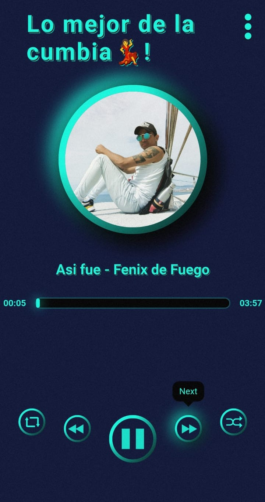
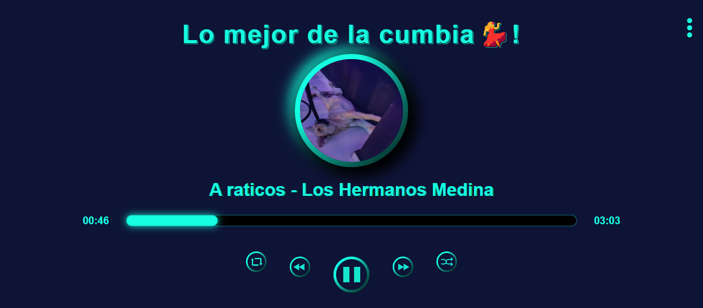
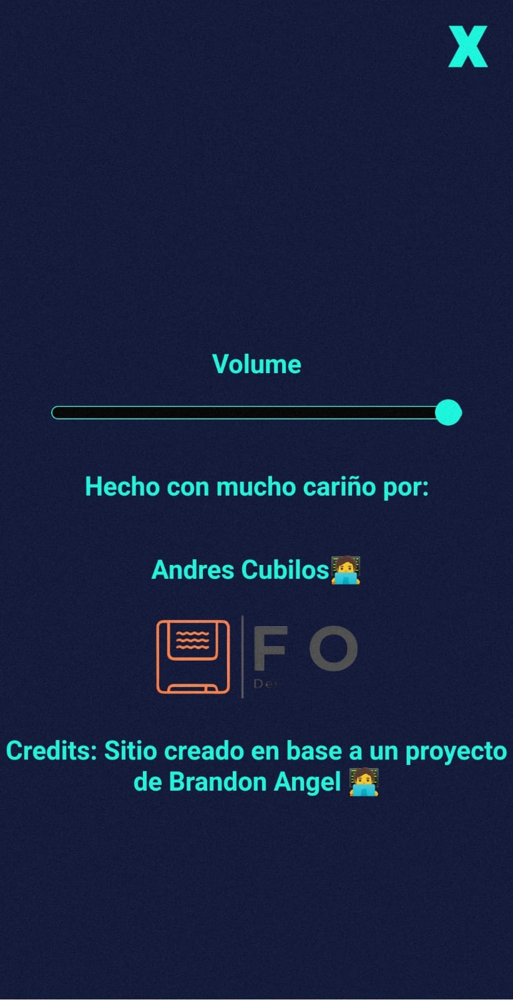

# 🎵 Reproductor de Música-Cumbia🎵​

!Sumérgete en el mundo de la música con este reproductor interactivo!
Este proyecto combina diseño moderno y funcionalidad para ofrecerte una experiencia única al escuchar tus canciones favoritas.

Descubre una interfaz intuitiva y atractiva donde puedes gestionar tu lista de reproducción, pausar, reproducir y navegar entre canciones fácilmente.

## Capturas de Pantalla 📷📷

- Página principal.

- Creditos

## Características

- Interfaz amigable y fácil de usar.
- Reproducción, pausa y cambio de canciones con un solo clic.
- Barra de progreso para navegar en cada canción.
- Diseño responsive para adaptarse a dispositivos móviles y de escritorio.

## Tecnologías Utilizadas 💻💻

- JavaScript
26.5%
 
- HTML
13.7%
 
- CSS
59.8%

## Licencia

Este proyecto está bajo la Licencia MIT. Consulta el archivo [LICENSE](LICENSE) para más detalles.

